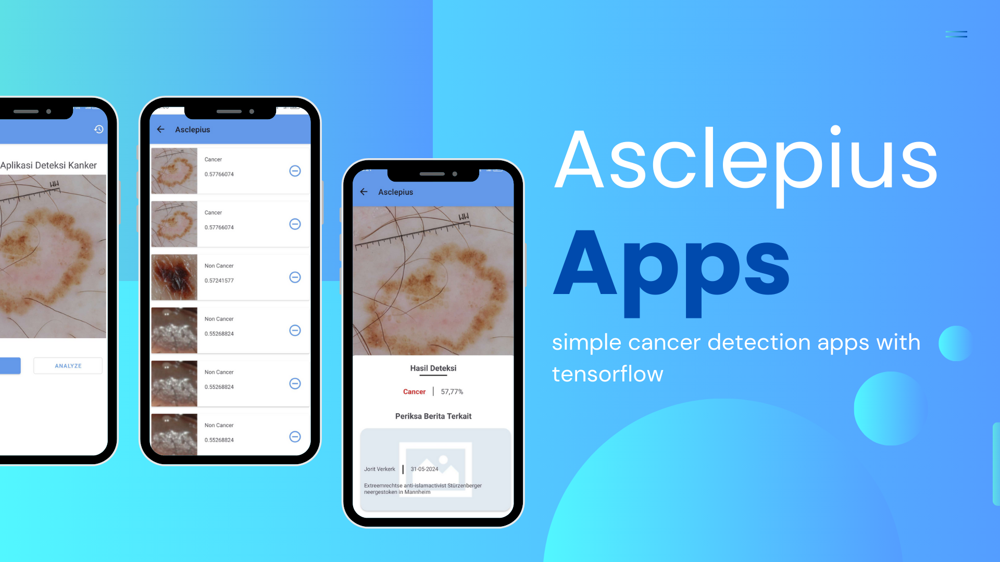

# Asclepius - Android App with ML Detection

## About the App

Asclepius is an Android application that leverages the power of Machine Learning to provide real-time object detection. The app integrates TensorFlow Lite to run machine learning models efficiently on mobile devices, offering seamless, on-device detection capabilities. It is designed to help users identify and classify various objects, making it ideal for health monitoring, diagnostics, or any application requiring image recognition.

The app showcases how machine learning models can be utilized in mobile apps to improve accessibility, automation, and interactivity through advanced AI models.

## Tech Stack

- **Programming Language**: Kotlin
- **Framework**: Android SDK
- **Machine Learning**: TensorFlow Lite
- **Model Format**: TensorFlow Lite (.tflite)
- **Image Processing**: OpenCV
- **Dependencies**: 
  - TensorFlow Lite Android Support Library
  - TensorFlow Lite Model
  - CameraX for real-time image capture
  - Kotlin Coroutines for background processing

## Features

- **Real-Time Object Detection**: Utilize TensorFlow Lite to detect objects in real-time through the device camera.
- **Efficient On-Device Processing**: ML models are optimized for mobile devices, ensuring fast and energy-efficient object recognition.
- **User-Friendly Interface**: Clean, easy-to-use UI that allows users to interact with the app seamlessly.
- **Edge Computing**: The app processes data locally on the device, providing faster response times and reducing dependency on cloud services.
- **Model Customization**: The app supports multiple models for different detection tasks, with the ability to easily swap between models.
- **Camera Integration**: Live camera feed is processed for object detection, supporting both front and back camera use.
